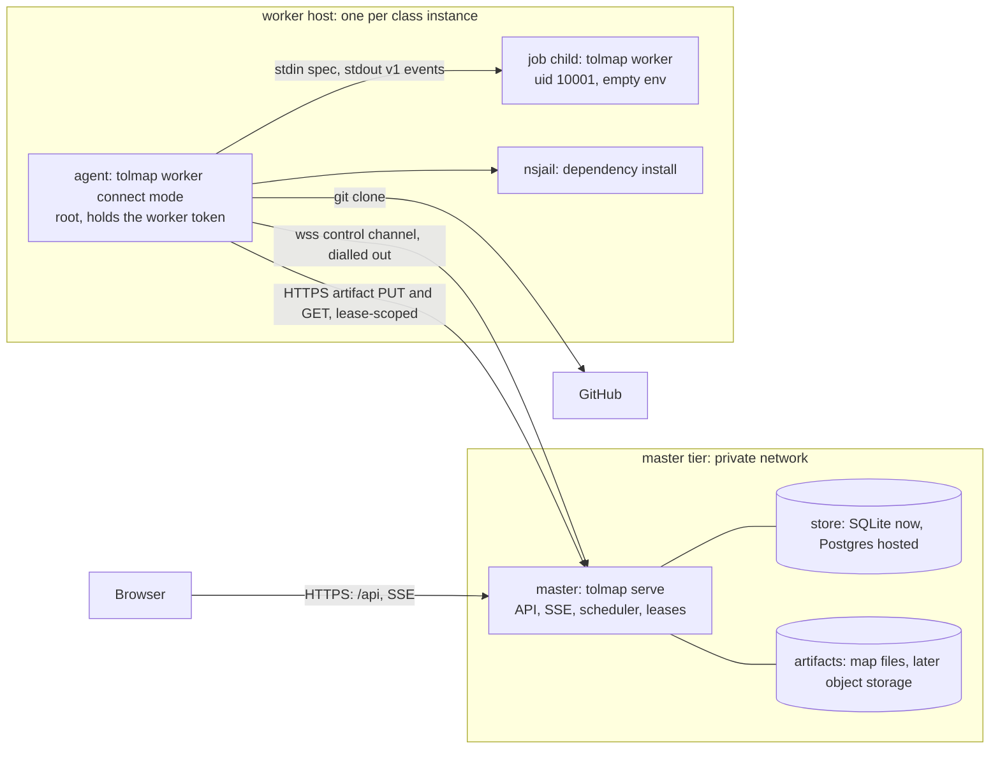
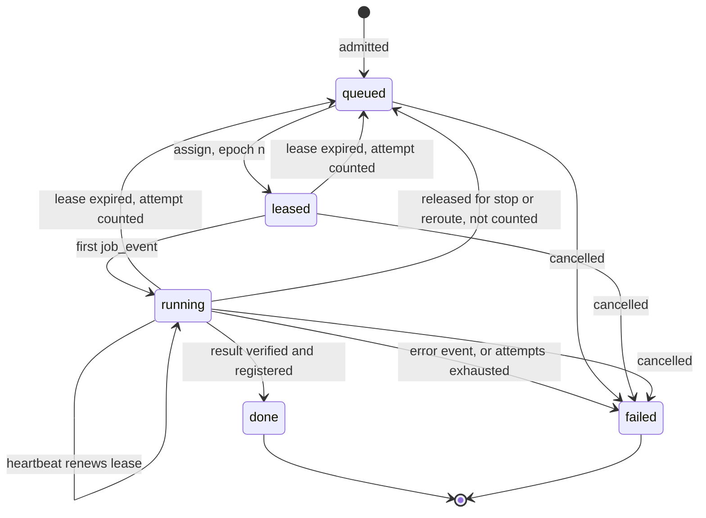
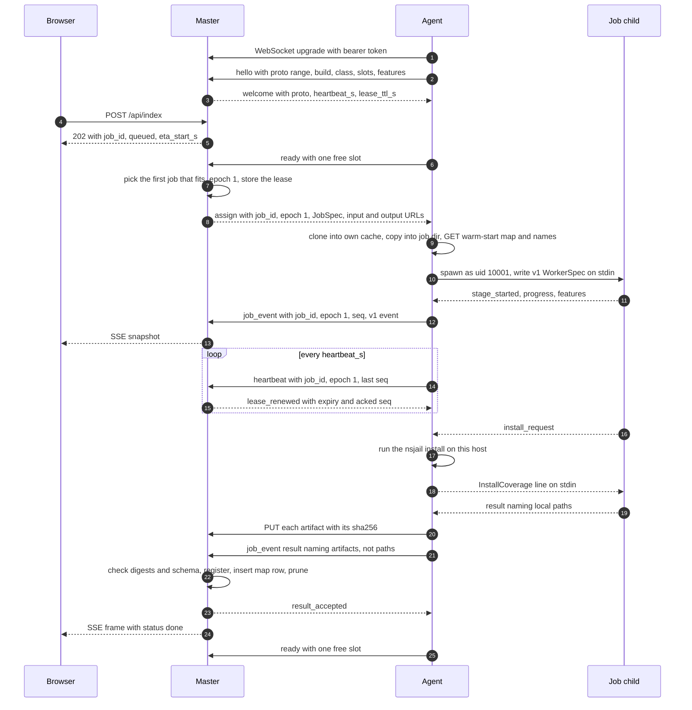
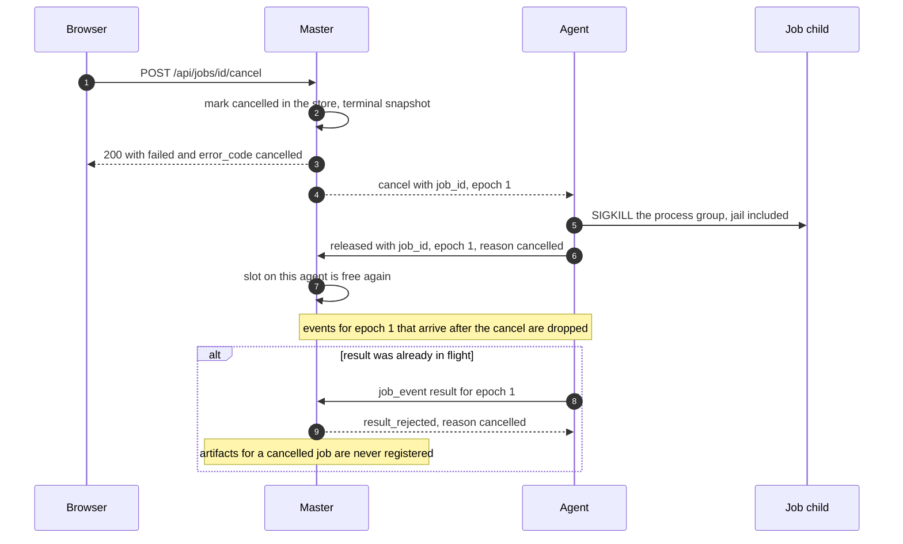
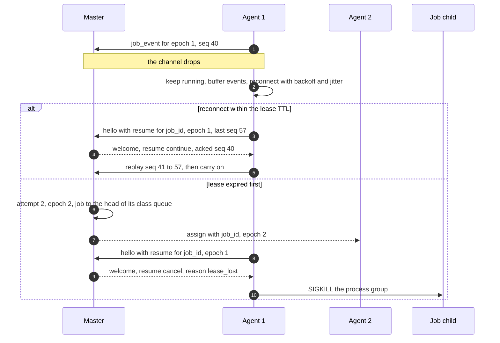

# Production worker tier (#97)

**Status: specification, not implemented; the owner's decisions on it are recorded in §10.** Owner timing ruling on [#97](https://github.com/onsager-ai/tolmap/issues/97) (AskUserQuestion, session `16030105`, transcript line 6521, 2026-09-25T13:51:51Z): **"After P2a merges."** P2a ([#127](https://github.com/onsager-ai/tolmap/pull/127)) merged 2026-09-25T18:07Z and the P1c sandbox ([#129](https://github.com/onsager-ai/tolmap/pull/129)) 17:48Z, so the design starts here. That ruling expected P2a to make SCIP the default; the owner then kept `hand` as the default (finding 45, "The default did not flip", 16:56Z). This matters below, because most hosted jobs are therefore small.

Owner rulings this document builds on, all on #97: **workers never touch the database**; they dial the master over WebSocket or another RPC channel, so the database is never exposed (2026-09-24). **No caps**: no file-count, clone-size, history-depth or job-time admission caps. **Cancel + queue ETA**: every queued job shows its ETA, including the jobs ahead of it (transcript line 2157, 2026-09-24T01:20:31Z).

The owner decided the spend, credential and exposure questions this design raised on 2026-09-26 (§10, recorded on #97): one 16 GB worker class with at most one worker, WebSocket, artifacts over HTTPS through the master, per-worker tokens on a private network with nothing public, the sandbox moving with the first remote worker, and bounded retries. Any change to those, and any platform API credential, stays reserved to the owner. This document is provider-neutral on purpose. Machine names, prices and deploy configuration belong in the private hosting repository, not here.

## Terms

| term | meaning |
|---|---|
| master | `tolmap serve` with the store: HTTP API, SSE, queue, leases, artifact registry. The only process that opens the database. |
| agent | `tolmap worker --connect <url>`: a long-lived process on a worker host that dials the master, takes jobs and runs each one in a job child. It plays the part `tolmap serve` plays for its child today. |
| job child | `tolmap worker` with no arguments: today's one-job process, reading a `WorkerSpec` on stdin and writing v1 `WorkerEvent` lines on stdout. Unchanged. |
| executor | the code that prepares a checkout, spawns the job child, relays its events, answers `install_request` and kills it on cancel. Today it lives inside `run_blocking` and `process_worker_exe` in `src/service/jobs.rs`; this design moves it into a module that both the master (local mode) and the agent call. |
| class | a worker's advertised usable memory and CPU count. Classes are numbers, not names. |
| lease | the master's record that one agent holds one job until a deadline, renewed by heartbeats. |
| epoch | a per-job counter the master increments on every assignment. It fences stale workers: anything carrying an old epoch is refused. |

## 0. Where this starts

The MVP seam is already most of the way there. What this design keeps and what it has to change:

- **One child per job, JSON lines.** `src/worker.rs` defines `WorkerSpec` and `WorkerEvent` (`stage_started`, `progress`, `stage_finished`, `features`, `log`, `result`, `error`, `install_request`), each carrying `v: 1`. `docs/API.md` "Worker protocol (v1)" is the contract. The child never opens the database.
- **The service does the trusted work around the child.** It clones into its own LRU cache, copies a fresh non-hardlinked checkout into a per-job directory, drops the child to uid 10001 with an empty environment plus an allowlist, and answers `install_request` by running the nsjail install as root (`run_blocking`, `process_worker_exe`, `ServiceInstall`).
- **Results are paths on a shared filesystem.** The child's `result` names `map_path`, `symbols_path`, `symbols_dir` and `names_cache`; the service moves them into the store. Paths cannot cross a network, so in remote mode results name artifacts instead (§3.4).
- **All job state is in memory.** The `JobRegistry` queue, cancel set and snapshots live in the serving process. A master restart fails every job (`server_stopping`), and the private deploy notes record the resulting risk when a platform stops an idle machine.
- **The cost model predicts time, not memory.** `src/service/eta.rs` predicts per-stage seconds from repository features (finding 38) and refits from completed jobs. Nothing predicts peak memory, which class selection needs.
- **The queue ETA assumes one slot.** `refresh_queue_etas` adds up the remaining time of every running job, then each queued job in turn. With `TOLMAP_MAX_CONCURRENT_JOBS` above 1 that overstates the wait, because a queued job starts when the first slot frees, not after all of them.
- **What jobs cost.** With `--refs hand`, the default, peak RSS tracks file count (finding 18, r = 0.937 on log–log): median 21 MB, 114 MB, 520 MB and 1.8 GB for the small, medium, large and ultra bands, p90 5.3 GB in ultra. There are two outliers: msgraph-sdk-python at 13.8 GB, and msgraph-sdk-go, which OOMed at 23.3 GB. With `--refs scip`, peaks are 0.4–3.9 GB on the nine small fixtures (finding 45) and 4.9–9.1 GB at corpus scale (finding 44). A sandboxed install adds up to 1.8 GB (finding 46: dify 8.65 GB, n8n 8.43 GB).

## 1. Goals and non-goals

**Goals**

1. **Scale out large reports.** Move indexing onto worker machines sized for it, and make the master able to run several workers and several classes, placing each job on one with enough memory. The first fleet is one 16 GB worker (§10.1); adding workers or classes later is configuration plus an owner spend decision, not a redesign.
2. **Isolate untrusted indexing from the master.** Repository-controlled bytes (clone, parse, indexers, installs) run on worker hosts that hold no database, no stored maps, no service secrets and nothing but their own worker token. A sandbox escape on a worker then reaches one worker, not the service. This ends the in-VM sandbox's accepted kernel-exploit risk (#117, `docs/SCIP_SANDBOX.md` §2 and §4.2).
3. **Keep the no-caps ruling.** No admission caps. A job that exceeds its worker's memory moves to a larger class; it fails only when no class can hold it.
4. **Honest per-job ETA with several workers.** Extend the owner's "cancel + queue ETA" to many workers and several classes, with the ETA computed by the same rule the dispatcher uses.
5. **One worker binary.** The same `tolmap` binary and image run the job child, the agent and the master. The job child and its v1 events are unchanged, so local and remote jobs run the same code on the same inputs and produce byte-identical maps.
6. **Survive a master restart** once the tier is on: queued and running jobs persist in the master's store.

**Non-goals**

- **Changing single-process mode.** With no worker configuration, `tolmap serve` behaves exactly as today: it spawns a local child per job, keeps the in-memory registry and fails jobs with `server_stopping` on shutdown. Self-hosters need nothing new.
- **Workers reaching the database** in any form, including through a query API. Workers get job specs and lease-scoped artifact URLs, nothing else.
- **Private repositories.** They are out of MVP scope (`docs/ARCHITECTURE.md`). The protocol leaves room for per-job clone credentials, but none are designed here.
- **Model naming on remote workers.** `OPENROUTER_API_KEY` never reaches a worker host. Hosting uses the default IDF namer. A later `naming_request` round-trip, shaped like `install_request`, could run model naming on the master.
- **Multi-master and cross-region scheduling.** Several API nodes sharing one store are covered in phase 4 (SSE fan-out stays internal to the master tier). A distributed scheduler is not.
- **Wall-time limits.** Consistent with the no-caps ruling, a hung job keeps its lease for as long as its agent heartbeats, and the user can cancel it.

## 2. Architecture



**The master owns all state.** The job table, queue, leases, epochs, cancel flags, snapshots, timing rows and the artifact registry live in the master's store. Workers never see a database path, a connection string or a store file. The agent asks for nothing: the master pushes a job spec and a set of URLs that are valid only for that job and epoch.

**Workers dial out.** An agent opens one authenticated WebSocket to the master's worker endpoint and keeps it open. Workers need no inbound ports, and nothing new is exposed except that endpoint. Artifacts move over plain HTTPS requests to URLs the master hands out (§4.2), so a 50 MB upload never sits in front of a heartbeat.

**The executor moves; the job child does not change.** `run_blocking` splits into three parts:

1. **prepare** (master): read warm-start candidates and the names cache from the store, choose the class, build a portable `JobSpec`;
2. **execute** (master in local mode, agent in remote mode): materialise the clone in its own cache, copy it into a fresh job directory, harden it, fetch inputs, spawn the job child with a v1 `WorkerSpec` whose paths are all local to that host, relay events, answer `install_request` with the local nsjail, kill the process group on cancel;
3. **register** (master): check the returned artifacts, move them into the store, insert the map row, save names, prune, record timings.

In local mode all three run in `tolmap serve`, exactly as now. In remote mode, execute runs in the agent, and the only things crossing the network are the `JobSpec`, v1 events, and artifact bytes.

**Implemented in local mode** (#97 phase 1): `jobs::prepare` and `jobs::register` in `src/service/jobs.rs`, and `executor::execute` in `src/service/executor.rs`. The executor takes no `AppState`, `Store` or `ServeConfig`: it gets the `JobSpec`, a `JobInputs` (the names cache by value, previous-map files by path), an `ExecEnv` naming this host's cache, job and install directories, worker binary and uid, and two callbacks, an `EventSink` for the child's events and a `CancelProbe` for cancellation. The master implements both against its registry exactly as before; an agent will implement them against the channel. Local mode still builds whatever the clone resolves HEAD to; checking out the pinned `JobSpec.commit` arrives with remote mode (§3.3). `tests/service_byte_identity.rs` holds `tolmap build` and `tolmap serve` to byte-identical map and symbols documents (§9).

### 2.1 Class selection

The master picks a class for each job from a **predicted peak RSS**, compared with each agent's advertised usable memory (total minus a reserve for the agent and the OS, 1 GiB by default).

The prediction uses, in order:

1. **This slug's own last measurement**, scaled by the change in file count. The same repository at a nearby commit is the best predictor there is.
2. **The reference mode**, known at admission: `scip` jobs start from findings 44–46's per-indexer peaks, and `hand` jobs from finding 18's per-band figures.
3. **Features reported mid-job.** The job child already sends `features` after clone and after detection (file and byte counts per language), and the agent forwards them. If the master's prediction from those features exceeds the agent's class, it sends `cancel` with `reason: "reroute"`, and on `released` it rebinds the job to the larger class, at the head of that queue. The memory model stays on the master; agents never need it. Clone and detection cost seconds, and the second attempt starts with known features instead of a guess.
4. **An OOM kill**, the last resort: re-queue on the next larger class (§6).

Memory needs a model next to the time model. Each finished job records its peak RSS alongside its stage durations: the agent (or the master in local mode) reads it from `wait4`, not `getrusage(RUSAGE_CHILDREN)` as an earlier draft of this document said. `RUSAGE_CHILDREN` is the maximum over *every* child the reaping process has ever reaped, so a small job run after a large one would report the large one's peak, and the service's own git clone and the root-run nsjail install would leak into the figure. `wait4` on the job child's own pid returns that child's own usage, which on Linux also covers whatever grandchildren it reaps itself (the SCIP indexers a `--refs scip` job spawns), and excludes the service's clone and install children — the same measure findings 41–46 report. The model fits log(peak) against log(files) per reference mode and language, seeded from the findings above, and uses an upper quantile. It errs high on purpose: underestimating memory costs an OOM and a rerun, while overestimating costs a larger machine for one job. This does not conflict with the rule that numbers must be a lower bound, which governs what a map reports, not internal scheduling estimates.

A job whose prediction exceeds every class is bound to the largest class anyway. No caps means best effort, never a rejection.

With the decided fleet of one class (§10.1), every job binds to that class, and rerouting (step 3) and OOM escalation (step 4) have nowhere to go: an OOM there fails the job (§6). The memory model is still worth building in phase 0. It records what jobs actually need, which is the evidence for any later class decision, and it makes class selection work the day a second class exists.

### 2.2 Job and lease states



These are the master's internal states, stored per job. The public `JobSnapshot.status` enum (`queued`, `cloning`, `detecting`, `indexing`, `done`, `failed`) is unchanged. `leased` shows as `queued` until the first event arrives. A re-queued job goes back to `queued` with its stages reset, and a note in `stage` saying why ("worker lost, retrying on another worker").

Defaults, all configurable: heartbeat every **15 s** (the same interval as the SSE heartbeat, well inside common proxy idle timeouts), lease TTL **60 s**. Any `job_event` also counts as a heartbeat. A heartbeat comes from the agent, not the job child, so a stage that runs for ten minutes without a progress event still keeps its lease, and so does the blocking `install_request` round-trip, which never leaves the worker host.

### 2.3 Claim, assign, progress, result



### 2.4 Cancel



As today, the cancel is terminal the moment the master records it, and a repeated cancel returns the same snapshot. The master counts the agent's memory as in use until `released` arrives or the lease expires, so it never assigns a second job onto memory the killed one may still hold.

### 2.5 Lease expiry and re-queue



## 3. Protocol

### 3.1 Two layers

The network channel carries **the same v1 job events** as the child's stdout, wrapped in an envelope, plus a small set of session messages. There are two version numbers:

- **`v`** on every job event: the existing worker protocol version, currently 1, unchanged. The job child keeps emitting exactly what it emits today.
- **`proto`**: the channel protocol version, negotiated once in `hello`/`welcome`. It covers the envelope and session messages.

The agent reads the child's stdout line by line, exactly as `process_worker_exe` does, and forwards each event inside a `job_event` envelope. Two events are handled on the worker host instead of being forwarded as-is:

- `install_request` is answered by the agent with its local nsjail (§5.5). The install never crosses the network. The resulting `stage_started`/`stage_finished` for `install` are forwarded as usual.
- `result` names local paths. The agent uploads each named file (§4.2) and forwards the event with the four path fields replaced by artifact names and a new `artifacts` list (§3.4).

Session messages are JSON text frames with a `type` tag, defined in Rust next to `WorkerEvent` with serde, like everything else on this seam.

### 3.2 Message catalogue

Worker → master:

| type | fields | when |
|---|---|---|
| `hello` | `proto_min`, `proto_max`, `worker_id`, `build` (crate version, commit, indexer versions), `class` (`memory_bytes`, `cpus`), `slots`, `features[]`, `resume[]` (`job_id`, `epoch`, `last_seq`) | first frame after the upgrade |
| `ready` | `slots_free` | willing to take work; repeated after each job |
| `job_event` | `job_id`, `epoch`, `seq`, `event` (a v1 `WorkerEvent`) | every child event, in order |
| `heartbeat` | `jobs[]` (`job_id`, `epoch`, `last_seq`), optional `rss_bytes` | every `heartbeat_s` |
| `released` | `job_id`, `epoch`, `reason` (`cancelled`, `lease_lost`, `server_stopping`, `reroute`, `worker_stopping`, `oom`), optional `peak_rss_bytes` observed | the agent has stopped a job and freed its memory |
| `draining` | none | the host is stopping: take no new work (§6) |

Master → worker:

| type | fields | when |
|---|---|---|
| `welcome` | `proto`, `heartbeat_s`, `lease_ttl_s`, `resume[]` (`job_id`, `action`: `continue` or `cancel`, `acked_seq`) | answer to `hello` |
| `assign` | `job_id`, `epoch`, `lease_ttl_s`, `job` (a `JobSpec`, §3.3), `inputs` (URLs), `outputs` (URL base) | a job for a free slot |
| `lease_renewed` | `job_id`, `epoch`, `expires_in_s`, `acked_seq` | answer to a heartbeat |
| `cancel` | `job_id`, `epoch`, `reason` (`cancelled`, `lease_lost`, `server_stopping`, `reroute`) | stop this job now |
| `result_accepted` / `result_rejected` | `job_id`, `epoch`, `reason` | after registering, or refusing, a result; the agent may then delete its job directory |
| `shutdown` | `mode` (`drain`: finish current jobs, then exit; `now`: release and exit), `reason` | rolling upgrades, scale-down |
| `error` | `code`, `message` | a protocol violation; the master closes the channel after sending it |

The issue's `claim` is `ready`: work is pulled by agents with free slots and assigned by the master, never taken by a worker on its own initiative.

### 3.3 JobSpec, and the v1 WorkerSpec the agent derives from it

`WorkerSpec` today mixes what the job is (slug, source, refs, prune variant) with where things are on disk (`cache_dir`, `output_dir`, `previous_maps[].path`, `names_cache`). Only the first half can cross the network. `assign` carries a portable **`JobSpec`**:

```json
{
  "slug": "django/django", "owner": "django", "repo": "django",
  "source": "https://github.com/django/django.git",
  "commit": "<sha pinned at admission>",
  "all_sources": false, "prune_variant": "node-relative",
  "namer": "idf", "refs": "hand", "install": null
}
```

plus input URLs (`names_cache`, and `previous_maps[]` as `{branch, url}`) and an output URL base. The agent clones and checks out the commit, learns the branch, downloads the one previous map the job child would choose (same branch, else newest), and writes an ordinary v1 `WorkerSpec` for the child with every path local to its host. The job child cannot tell whether it runs under `tolmap serve` or an agent.

Two rules keep this safe and deterministic:

- **`source` is always a public `https` URL in remote mode.** `{"path": ...}` jobs (`local/<name>` slugs) are only assigned to agents that advertise the `local_paths` feature, which only loopback agents on the master's own host do.
- **The commit is pinned.** The master resolves the commit before admission and the cache key is `(slug, commit)`; the agent checks out that commit, not whatever the branch points to by then. Today the child resolves HEAD itself after cloning, which can differ from the admitted commit if the branch moved in between. Remote mode closes that gap; local mode keeps its current behaviour unless phase 1 fixes both.

### 3.4 Results and artifacts

The forwarded `result` event keeps every v1 field and adds one optional field, so v1 consumers still parse it (placeholders in angle brackets):

```text
{"type": "result", "v": 1,
 "map_path": "artifact:map", "symbols_path": "artifact:symbols",
 "symbols_dir": "artifact:symbols_dir", "names_cache": "artifact:names",
 "commit": "<sha>", "branch": "main", "lang": "py",
 "files": <n>, "districts": <n>, "modularity": <q>,
 "artifacts": [
   {"name": "map", "sha256": "<hex>", "bytes": <n>},
   {"name": "symbols", "sha256": "<hex>", "bytes": <n>},
   {"name": "symbols_dir/0.json", "sha256": "<hex>", "bytes": <n>},
   {"name": "symbols_dir/1.json", "sha256": "<hex>", "bytes": <n>},
   {"name": "names", "sha256": "<hex>", "bytes": <n>}
 ]}
```

Owner's change (phase 1): `symbols_dir` is not uploaded as a tar. Each entry the worker wrote into it (`<digits>.json`, see `src/service/worker_result.rs`) is its own artifact, named `symbols_dir/<file name>`, so one failed upload costs one district, not the whole result. An artifact name accepts only `map`, `symbols`, `names` and `symbols_dir/<digits>.json` (`worker::is_valid_artifact_name`); anything else, including one with an extra `/` or a `..` component, is refused. In remote mode the master refuses a `result` whose path fields are anything but `artifact:` names.

### 3.5 Ordering, acknowledgement and resume

- `seq` starts at 1 for each `(job_id, epoch)` and rises by one per `job_event`. The master applies events in `seq` order and ignores any `seq` it has already applied.
- `lease_renewed.acked_seq` tells the agent what it may drop from its buffer.
- While disconnected, the agent keeps running its jobs and buffers events. Progress is coalesced to the latest value per stage. `stage_*`, `features`, `error` and `result` are kept in order. `log` lines are kept up to a bound, and a marker notes any dropped. The buffer is therefore bounded by the number of stages, not by the job's length.
- On reconnect, `hello.resume` lists each job the agent still holds. The master answers `continue` with its `acked_seq` when the lease is still valid and the epoch current, otherwise `cancel` with `lease_lost`.
- An agent that holds a finished result keeps it on disk and keeps retrying the connection for a configurable hold time (24 h by default) before discarding it.

The master persists a job's snapshot at stage boundaries and every few seconds, not at every progress event. After a master restart the snapshot is at most that far behind, and the next events bring it up to date.

### 3.6 Versioning and compatibility

- **Additive changes do not bump anything.** A new optional field uses `#[serde(default)]` and is skipped when unset, the pattern `WorkerSpec.refs` and `install` already follow.
- **New message types are gated by features, not versions.** A peer sends a message type only if the other side listed its feature in `hello` (for example `install_sandbox`, `resume`, `local_paths`). An unknown `type` from a peer that was not offered it is a protocol error.
- **Breaking changes bump `proto`.** The master accepts the current and previous `proto`, so a rolling upgrade can move the master first and the workers after. `welcome` picks the highest version both sides support. With no overlap, the master sends `error` `unsupported_proto` and closes.
- **The job child's `v` stays 1** until a job event changes incompatibly. An agent only spawns a job child from its own binary, so agent and child always agree.

**Build identity is a scheduling constraint, not only a version.** tolmap promises that the same repository at the same commit produces a byte-identical map. A worker running a different build, or different indexer versions under `--refs scip`, can produce a different map for the same `(slug, commit)`, and the cache would keep whichever finished first. The master therefore assigns jobs only to agents whose `build` matches its own. A mismatched agent stays connected but idle, and is visible in the master's worker list. A rolling upgrade drains old agents (`shutdown` `drain`) rather than letting both builds serve at once.

## 4. Transport

### 4.1 Control channel: WebSocket (decided, §10.2)

The control channel is a WebSocket served by axum, using its `ws` feature (which brings `tokio-tungstenite`) on the server and `tokio-tungstenite` with rustls in the agent. Frames are JSON text built from the serde types in `src/worker.rs`, so the protocol's types stay defined once in Rust and the v1 events cross unchanged. The upgrade is plain HTTP/1.1, which passes reverse proxies and platform edges. The 15 s heartbeat doubles as keepalive against idle timeouts. TCP provides the only transport-level backpressure, so the application bounds its send queue and coalesces progress (§3.5). That is enough, because the only large payloads travel outside the channel (§4.2). A fake worker can be played with `websocat` in tests and debugging.

*Considered: gRPC bidirectional streaming (tonic).* It offers per-stream flow control, deadlines and binary framing. But it needs a `.proto` file, which is a second hand-written definition of the worker events that `CLAUDE.md` rules out, or opaque JSON inside protobuf. It would also bring a second server stack beside axum and need HTTP/2 end to end, which some platform edges do not provide by default. At a few frames a second per job its advantages do not matter.

### 4.2 Artifacts: HTTPS through the master (decided, §10.3)

A map plus its symbols document and per-district files is small for most repositories (the nine committed fixtures are 0.1–0.6 MB each) but can reach tens of MB on the largest ones. That figure is the issue's estimate: the largest corpus map's size was not measured for this document. Artifacts flow both ways: results up, and warm-start maps and names caches down.

Artifacts move as plain HTTPS requests to the master, on the same private listener as the channel (§5.6):

- `PUT /workers/artifacts/{job}/{epoch}/{name}` uploads a result artifact, with the worker token and the artifact's SHA-256. The master checks that this worker holds the lease at that epoch. It streams the body to disk while hashing, never buffering it, and refuses the upload on a digest or size mismatch.
- `GET` on the input URLs in `assign` fetches the previous map and the names cache, under the same lease check.
- A retry is harmless: stored artifacts are content-addressed, so a repeat upload is a no-op.
- Artifacts are stored on the master's disk, as maps are today.
- **Retention is unchanged:** the newest `TOLMAP_RETAIN_COMMITS_PER_REPO` commits per slug, never the newest row. In addition, uploads from jobs that never registered (failed, cancelled or superseded) are deleted after 24 h.

`assign` gives the agent URLs, and the agent does not care where they point. Moving to presigned object-storage URLs therefore needs no protocol or worker change. That move waits until the master tier has more than one API node (phase 4), and it needs an object store, which is an owner decision.

*Considered: streaming artifacts over the WebSocket.* It would put heartbeats and cancels behind 50 MB of chunks unless frames were interleaved by hand, and it needs its own chunk-resume logic. *Considered: presigned object storage now.* It adds an object store, its credentials and a retention policy, for no benefit while there is one master node.

### 4.3 Frame and message bounds

These bound the protocol, not jobs: the master rejects a control frame over 1 MiB (the largest legitimate frame is a `features` or `log` event), limits each agent's frame rate, and refuses an artifact whose declared size disagrees with its body. None of these limits a repository's size.

## 5. Security

### 5.1 Worker authentication (decided, §10.4)

Each worker has its own **bearer token**. The agent presents it in the `Authorization` header of the WebSocket upgrade and of every artifact request, never in a URL, where it would be logged. Every connection uses TLS (`wss`, `https`) except loopback.

Tokens are random 256-bit values. The master stores them only as SHA-256 hashes, in a file named by configuration, each line binding a hash to a `worker_id`. The master compares in constant time. Revoking a worker means deleting its line. Rotating means adding a new line, moving the worker to the new token, then deleting the old line. A small `tolmap worker-token new --id <id>` command prints a token once, together with the line to add. **The owner issues and rotates the tokens.** Nothing in phases 0–2 needs one: loopback agents get an ephemeral token that the master generates in memory at start-up (§8).

On the worker host the token sits in a root-only file (mode 0600) that the agent reads. The job child runs as uid 10001 with an empty environment, so it can read neither the file nor the agent's memory.

*Considered:* mutual TLS with a private CA, which means running a CA for no gain at one worker; and platform workload identity (OIDC), which ties the protocol to one provider.

### 5.2 What reaches a worker host, and what never does

Reaches it: the `JobSpec` (public repository URL, commit, build options), URLs valid for one job and epoch, the previous map and names cache for that slug (both already public through the API), and its own token.

Never reaches it: the database or any path or credential for it, other slugs' maps except through URLs issued for a job it holds, the master's filesystem, `OPENROUTER_API_KEY` or any other service secret, platform API tokens, and other workers' tokens. The master's store and its internal event fan-out (phase 4) sit on a network workers cannot address.

### 5.3 What a compromised worker can and cannot do

Assume an attacker controls a worker host completely, root included, for example after a kernel exploit from the install jail.

| can | bounded by |
|---|---|
| return a wrong map for jobs leased to it | results are accepted only for the current epoch of a job that worker holds; artifacts are schema-checked on registration; determinism spot-checks (§5.4) catch a forged map with the probability of the sampling rate; revoking the token ends it |
| hold jobs and do nothing | a held job keeps heartbeating, so it is never re-queued by lease expiry; the user can cancel; the operator can revoke the token, which drops the channel, expires the lease and re-queues the job |
| read the specs, warm-start maps and names caches of jobs assigned to it | the same data is public through the API |
| flood the master with frames or uploads | per-agent frame-rate and frame-size bounds (§4.3); uploads only to URLs issued for its own lease |
| use its token from elsewhere | the token is per worker and revocable; a stolen token gives exactly the list above |

| cannot | why |
|---|---|
| read or write the database | no route, no path, no credential ever reaches the host |
| read or overwrite another slug's stored maps | artifact URLs are scoped to a job and epoch the worker holds; the master writes stored maps only after registration, under content-addressed names it chooses |
| choose where the master writes | results name artifacts (§3.4), never paths; the master chooses every path it writes |
| mint tokens, see other workers' tokens, or reach other workers | tokens are issued out of band and stored hashed; workers dial the master only |
| obtain service secrets | none are on the host (§5.2) |

### 5.4 Checking results

Registration checks each artifact's SHA-256 and size, parses the map as a `MapDocument` and the symbols document against its schema, and checks that the result's `commit` is the job's pinned commit and `files` and `districts` match the document. Because tolmap's output is deterministic, the master can also re-run a sample of jobs on a second worker and compare digests. A mismatch is either a determinism bug or a lying worker, and both are worth an alert. The sampling rate is an operational setting; one job in fifty costs 2% more compute. Two results for the same `(slug, commit)` from different jobs should always be byte-identical, and the master logs any that are not.

### 5.5 Where the nsjail sandbox goes (decided, §10.5)

The install sandbox moves with the executor: it runs on the worker host, started by the root agent, exactly as the root service starts it today (`docs/API.md` "Dependency installs"). Policy, mounts, egress proxy, self-test and the 20 min / 20 GB fallback bound are unchanged. `docs/SCIP_SANDBOX.md` §4.2 sets out why this ends the accepted risk: a kernel exploit from the jail now becomes root on a worker host that holds one token and no master data, instead of root on the machine holding the store, every map and the service's secrets. The in-VM jail still matters there, because it keeps install code away from the agent's token and the host's network.

Two consequences follow. In remote mode the master no longer needs root, since it spawns no children and starts no jails, so it can run unprivileged. And the indexers, which run as the worker uid outside the jail (`docs/API.md` "Not covered"), now do so on a host with nothing of the master's to reach.

**Installs stay off in hosting until phase 3** (§10.5). Production runs `TOLMAP_REFS=hand` today, so neither installs nor indexers run in hosting, and the kernel-exploit risk accepted on #117 stays latent until then. In phase 3 the sandbox moves with the executor to the worker host, and `TOLMAP_SCIP_INSTALL=sandbox` may then be set there, never on the master.

### 5.6 The worker endpoint: a private listener (decided, §10.4)

The worker endpoint (the channel and the artifact URLs) is a separate listener (`TOLMAP_WORKER_BIND`, unset by default, meaning off), not a route on the public site's port. **It is reachable only on the provider's private network between the master and its workers. Nothing about it is public.** Loopback mode binds it to `127.0.0.1`. Keeping it off the public port also keeps it out from under the `/api` per-IP rate limit and the static-site fallback. Workers still dial out to the master and need no inbound ports. TLS and tokens apply on the private network too, so a peer that reaches the network still cannot act as a worker without a token.

## 6. Failure semantics under the no-caps ruling

No failure below is an admission cap: nothing is refused for size or time. Jobs fail only when the machine cannot finish them, and then with the codes clients already know. `worker_crashed` keeps its meaning, with a message that says what happened, since clients render unknown codes as a generic failure anyway (`docs/API.md` "Errors").

| event | detected by | master action | job outcome |
|---|---|---|---|
| **job child OOM-killed** | agent: child killed by SIGKILL with the memory cgroup's `oom_kill` count raised (or, without a cgroup, SIGKILL not sent by the agent) | agent sends `released` `oom` with the observed peak; master records the peak, rebinds the job to the next larger class, puts it at the head of that class's queue, epoch + 1 | continues on a larger worker if a larger class exists; otherwise fails `worker_crashed` ("out of memory on the largest worker class"). With the decided single class (§10.1), an OOM fails the job |
| **job child crashes otherwise** | agent: exit without `result` or `error` | forwarded as today | fails `worker_crashed` with exit status and last stage, as today |
| **worker host dies, or its OOM takes the agent too** | lease expiry | attempt + 1, epoch + 1, head of the same class's queue; if that host died of memory (last heartbeat's `rss_bytes` near its class), rebind to the next class | continues; after the retry bound (§10.6), fails `worker_crashed` ("lost N workers"), never refused at admission |
| **channel lost, worker alive** | both sides | nothing within the lease TTL; the agent resumes (§3.5) | uninterrupted |
| **channel lost past the lease TTL** | lease expiry | as "worker host dies"; the old agent learns `lease_lost` on reconnect and kills its child | continues elsewhere |
| **master restarts mid-job** (remote mode) | agents see the channel close | on start-up, jobs and leases load from the store and every lease's deadline is extended by one TTL, so agents have time to reconnect and resume | uninterrupted; SSE clients reconnect and catch up with `GET` first, as `docs/API.md` already asks |
| **duplicate or stale result** | epoch and job state | a result for a stale epoch, or for a job already terminal, is refused with `result_rejected` and never registered; a repeat for the current epoch with the same digests is acknowledged again | unaffected |
| **cancel races** | job state in the store is the only truth | cancel before `assign` is sent: the job never leaves the queue. Cancel after `assign` but before the first event: `cancel` follows `assign` on the same ordered channel. Cancel while `install_request` is running: the agent kills the jail with the process group, as the service does today. Result in flight when the cancel lands: refused (§2.4) | `cancelled`, always |
| **master graceful stop** (SIGTERM) | — | local mode: unchanged, every queued and running job fails `server_stopping`. Remote mode: admission stops with `503 server_stopping`, jobs stay in the store, agents keep running and reconnect when the master is back | local: `server_stopping`. Remote: uninterrupted |
| **worker graceful stop** (host SIGTERM, scale-down) | agent | agent sends `draining`; if a job finishes within the host's grace period its result is delivered, otherwise the agent kills it and sends `released` `worker_stopping`; the master re-queues it at the head of its class queue without counting an attempt | continues elsewhere |
| **master sends `shutdown`** | agent | `drain`: finish current jobs, then exit; `now`: release them as above | as above |
| **clone fails on the worker** | job child `error` | forwarded | fails `clone_failed`, as today |

Remote mode changes one documented behaviour: after a master restart, jobs continue instead of failing with `server_stopping`. That is an additive improvement for clients, which already have to handle a closed SSE stream, and `docs/API.md` "Graceful shutdown" gains a remote-mode paragraph when phase 2 ships. Local mode keeps today's contract word for word.

A known gap carries over. Cancelling during the clone does not kill the git children that `clone::materialize_with_progress` spawns (`materialize_job_repo`'s doc comment). The agent calls the same code, so a cancel during a remote clone also waits for git to finish before the slot is released. The fix, threading a cancel hook through the git plumbing, is independent of this design.

## 7. Scheduling

### 7.1 One queue per class, strict order within each

At admission each job is **bound to the smallest class that fits its predicted peak** (§2.1): the largest if none fits, and the only one if the fleet has only one. Each class has its own FIFO queue, in admission order.

When an agent sends `ready`, it takes the head of its own class's queue. If that queue is empty, it may take the head of a smaller class's queue ("spill down"). An agent never takes work from a larger class, and nothing is ever preempted.

This gives the property the owner asked for: **a large job does not block small ones.** A 13 GB job waits for a large worker while small jobs keep flowing through small workers. The reverse holds too. A large worker spills only when its own queue is empty, so a large job that arrives waits at most for the one small job that worker is already running. No reservation logic is needed.

With one class this is exactly today's single FIFO. That covers every deployment through phase 2 and the decided phase 3 fleet of one 16 GB worker (§10.1). With a single worker, a large job does delay the small jobs behind it, as it does today. The property above needs a second worker or class, which is a later owner spend decision, and the design is ready for it.

### 7.2 Queue ETA with several workers

The per-job ETA comes from simulating the dispatcher's rule, so the estimate and the scheduler cannot disagree:

```
free_at[w]  = now + remaining midpoint of w's current job   (now if idle)
            = lease deadline, for a worker whose job is being cancelled
            = now + cold-start estimate, for capacity an autoscaler may start (§7.4)
for each class c, largest first, and each queued job j bound to c, in order:
    w = the worker able to take j (class c, or larger and spilling) with the smallest free_at;
        ties broken by worker id, so the result is deterministic
    j.eta_start_s = free_at[w] - now
    free_at[w]  += j's predicted midpoint
```

With one worker this reduces to today's `refresh_queue_etas` sum exactly, and the phase 0 test pins that equivalence. With `TOLMAP_MAX_CONCURRENT_JOBS` above 1 in local mode it fixes the overestimate noted in §0. `queue_position` becomes the position within the job's class queue, which is the count of jobs that must start before it, as the field already means. An optional `eta_start` range (`low_s`, `high_s`, from the low and high ends of each job ahead) can be added next to `eta_start_s` without changing it.

Phase 0 checks the claim that the estimate and the scheduler cannot disagree instead of assuming it ([#148](https://github.com/onsager-ai/tolmap/pull/148)). `src/service/schedule.rs` replays the dispatch rule itself as events, where the worker that frees next takes whatever queue `next_for` names, and compares that replay with this pseudo-code on 5,000 generated queue shapes with up to three classes and four workers, ties included. They agree job for job and bit for bit. Two details of the pseudo-code carry that agreement, and an implementation that drops either one breaks it:

- **Classes are taken largest first.** Taking queued jobs in admission order across classes would let a large worker that frees first take an older small job while a large job waits in its own queue, which dispatch never does. By the time a smaller class is simulated, every larger job is placed, each no later than the time any larger worker is left free at, so a larger worker is only offered small jobs from the moment its own queues are empty.
- **The tie-break by worker id belongs to the dispatcher too.** Worker ids run smallest class first, and a job admitted while several eligible workers are idle starts on the lowest id. It therefore takes an idle worker of its own class before an idle larger one, in the simulation and in dispatch alike.

The implementation keeps times relative to now (`free_at - now` as a remaining time from the start), because `(now + a) - now` is not `a` in floating point, and the one-slot equivalence is exact, not within a rounding error.

The ETA is only as good as its inputs. Finding 38 measured a cold-start n8n underestimate of 42 s at 10% of the run. With several workers, the start estimate of a queued job adds up several such errors, so the range widens with queue depth. That is honest, and the UI already shows a range.

### 7.3 Fairness

Admission already bounds request frequency per IP (30 a minute) and index requests per repository (3 per 5 minutes), and the queue length (`TOLMAP_MAX_QUEUED_JOBS`, 16). Within a class, strict FIFO keeps every queued job's ETA stable: no later job can jump it, which is what makes "the jobs ahead of it" a promise rather than a guess. Shortest-job-first would finish more jobs sooner but make every queued ETA unstable, so it is not proposed. If a single requester floods a class within the rate limits, a round-robin across requesters inside each class queue is the next step. It changes FIFO positions, so it is left until measurement shows a need.

With several classes, `TOLMAP_MAX_QUEUED_JOBS` applies per class, so a backlog of large jobs cannot fill the queue that small jobs need. A job that joins a full class queue gets `503 busy`, as today.

### 7.4 Starting and stopping workers

The decided bounds are one class and **at most one worker, stopped when idle and started when a job is queued for it** (§10.1). The master exposes desired capacity per class: running plus queued jobs bound to that class, clamped to the configured maximum (1), dropping to zero after a configurable idle period. A provider-specific starter acts on it, and its configuration lives in the private hosting repository. If starting a worker needs a platform API credential, issuing that credential is a separate owner decision. A stopped worker is counted in the ETA simulation at its measured cold-start time, which is refitted like a stage duration. General autoscaling, meaning more than one worker per class, is phase 4 and needs new bounds from the owner.

## 8. Migration plan

Every phase ships on its own, keeps single-process mode unchanged and on by default, and passes CI without real hosting. Phases 0–2 need no new hosting spend and no owner credential.

| phase | ships | new spend or credential |
|---|---|---|
| 0 | memory measurement and model, one-queue-per-class scheduler with the ETA simulation (one class in practice) | none |
| 1 | the executor split, channel protocol `proto` 1, `tolmap worker --connect`, the worker listener, `TOLMAP_WORKERS=loopback:N` | none |
| 2 | durable jobs and leases in the store, resume, restart survival, rerouting and OOM escalation, loopback agents advertising configurable classes | none |
| 3 | one remote 16 GB worker on the private network, stopped when idle; the sandbox moves there; loopback agents off; the master can shrink and run unprivileged | decided (§10.1, §10.4, §10.5); tokens issued by the owner |
| 4 | more workers or classes, presigned object storage, Postgres with several API nodes and internal SSE fan-out | **yes**: new bounds, object store, database (not yet decided) |

**Phase 0: measure and schedule, in today's process.**
- The master records the job child's peak RSS (`wait4`, not `RUSAGE_CHILDREN` — see §2.1) after reaping, next to its stage durations in `job_timings`, and `eta.rs` gains a peak-memory prediction seeded from findings 18 and 44–46. It changes nothing about a map, so the determinism and parity gates are untouched. **Implemented in [#149](https://github.com/onsager-ai/tolmap/pull/149).**
- `refresh_queue_etas` is replaced by the §7.2 simulation over a scheduler with per-class queues. Local mode has one class with `TOLMAP_MAX_CONCURRENT_JOBS` slots, so single-slot behaviour is identical and multi-slot ETAs become correct. **Implemented in [#148](https://github.com/onsager-ai/tolmap/pull/148)** (`src/service/schedule.rs`): jobs bind to a class from the memory model's reference-mode prior (wired in [#149](https://github.com/onsager-ai/tolmap/pull/149)); local mode has one class, so every job still binds to it.

**Phase 1: the network protocol, over loopback.**
- `run_blocking` splits into prepare, execute and register (§2). Local mode calls execute in-process and its behaviour is byte-for-byte unchanged.
- The channel protocol lands in `src/worker.rs` beside `WorkerEvent`, as serde types. `tolmap worker --connect <url> --token-file <path>` runs the agent, and the master gets the worker listener and artifact endpoints.
- `TOLMAP_WORKERS` selects the mode: unset or `local` is today's behaviour; `loopback:N` makes `tolmap serve` start N agents on its own host that dial `127.0.0.1` with an ephemeral token and their own cache directories under `cache_dir/agents/<n>` (never the store). On today's single production machine this runs the whole network protocol with no new hosting, the same memory and the same root-started sandbox. It is a switch the owner can turn on or off by configuration.
- State is still in memory in this phase, so a restart still fails jobs, now through the agents.

**Phase 2: durability and classes.**
- A `jobs` table in the master's store holds status, class, attempt, epoch, lease holder and deadline, and the last persisted snapshot. The in-memory registry becomes a cache of it in remote and loopback modes. Local mode keeps its in-memory registry and shutdown contract.
- Resume after a dropped channel, restart survival with the lease-deadline extension, reroute after `features`, OOM escalation and the retry bound (§10.6).
- Loopback agents take a configured `class` override, so CI can run a "small" and a "large" loopback agent on one runner and exercise class selection, spill-down and escalation for real.
- `docs/API.md` gains the remote-mode shutdown paragraph and any additive snapshot fields.

**Phase 3: the first remote worker (decisions §10.1, §10.4, §10.5).**
- One 16 GB worker host runs the same image as `tolmap worker --connect wss://<master's private address>/…` with an owner-issued token. It is stopped when idle and started when a job is queued (§7.4).
- The worker listener is bound to the provider's private network only (§5.6). Nothing new is public.
- The sandbox runs on the worker host. Installs, off in hosting until now, may be enabled there with `TOLMAP_SCIP_INSTALL=sandbox`, never on the master.
- Loopback agents are switched off, which removes untrusted indexing from the master. The master can then shrink and run as a non-root user.
- The hosting configuration lives in the private hosting repository.

**Phase 4: scale.** More workers or classes within new owner-set bounds, presigned object storage once there is more than one API node (§4.2), and several API nodes on Postgres with the SSE fan-out kept on the master tier's private network (LISTEN/NOTIFY or equivalent), never reachable by workers.

## 9. Test plan

This repository's rule is that heavy builds and browser checks run on GitHub Actions, and everything below is designed for standard runners with no hosting.

**What CI proves**

- **Protocol shape.** Serde round-trip tests for every session message and the enveloped v1 events, like `worker.rs::protocol_round_trip`. A v1 `WorkerEvent` stream from an unmodified job child parses unchanged inside envelopes. Unknown optional fields are ignored and ungated message types are refused.
- **Byte identity across execution paths.** The same fixture through `tolmap build`, through `tolmap serve` in local mode and through `tolmap serve` with `loopback:2` produces byte-identical map and symbols documents. This is the determinism rule extended to the new seam, and the strongest single test here.
- **The single-slot ETA is unchanged.** The phase 0 simulation reproduces today's `refresh_queue_etas` values exactly for one slot, over a table of queue shapes. Multi-slot and multi-class cases are checked against hand-computed schedules.
- **Class selection and spill-down.** With a "small" and a "large" loopback agent, a large job waits for the large agent while small jobs run on the small one; a large job that arrives while the large agent spills starts after that one small job.
- **Failure injection**, with a small in-process TCP relay between agent and master that can pause, drop or cut the connection:
  - kill the agent mid-job: the lease expires, the job re-runs on the other agent and ends `done`, and the result is byte-identical;
  - drop the channel for less than the TTL: the job resumes without a re-run, and its snapshot has no gap or decrease in progress (the existing "progress never decreases" SSE test, extended);
  - SIGKILL and SIGTERM the master mid-job, then restart it on the same store: the job completes (phase 2);
  - a fake OOM (a test job child that kills itself with SIGKILL after raising a marker): the job escalates to the larger agent; on the largest it fails `worker_crashed`;
  - duplicate and stale results from a scripted fake agent: refused, never registered;
  - the cancel race matrix of §6, including cancel during `install_request` (the image workflow already runs the install through `tolmap serve` in a `--privileged` container, and gains a loopback variant);
  - worker `draining` and master `shutdown` in both modes; local-mode `server_stopping` tests stay green unchanged.
- **Authentication and scoping.** No token, a wrong token, a revoked token, a token for another `worker_id`, a result for a job the agent does not hold, an artifact with the wrong digest or size, an over-sized frame, and a remote result naming a filesystem path: each is refused and none reaches the store. A test asserts that no `WorkerSpec` or `JobSpec` an agent receives contains the store's path.
- **Bindings.** Any field added to `JobSnapshot` goes through the existing generated-bindings check.

**What CI cannot prove**

- Real network partitions and latency between hosts, and the platform edge's handling of long-lived WebSockets and idle timeouts.
- Worker cold-start times, image pull times, and the autoscaler against a real provider.
- The sandbox on the production kernel and cgroup setup (finding 46 "What was not exercised" still applies, now on the worker host).
- Memory predictions for repositories the corpus lacks. The model refits from production jobs; its accuracy there has to be watched, not assumed.

These need a staging worker host, which is phase 3 and spend.

## 10. Decisions

The owner decided all six questions this specification raised (AskUserQuestion, session `16030105`, 2026-09-26; recorded on [#97](https://github.com/onsager-ai/tolmap/issues/97), 2026-09-26T06:07Z). The alternatives considered are noted in the sections cited.

**10.1 Worker classes and bounds.** One 16 GB class, at most one worker, stopped when idle and started when a job is queued (AskUserQuestion, session `16030105`, 2026-09-26). This is the size production already runs. Considered: a small class for hand jobs next to it, and an on-demand 32 GB class for the msgraph-sized outliers. The phase 0 memory measurements are the evidence for revisiting this. See §2.1, §7.1 and §7.4.

**10.2 Control channel.** WebSocket on axum. The protocol's types stay defined once in Rust (AskUserQuestion, session `16030105`, 2026-09-26). Considered: gRPC bidirectional streaming. See §4.1.

**10.3 Artifacts and retention.** HTTPS PUT and GET through the master, scoped to the job's lease, stored on the master's disk. Today's retention stays, and uploads from jobs that never registered are deleted after 24 h. Object storage waits until there is more than one API node (AskUserQuestion, session `16030105`, 2026-09-26). See §4.2.

**10.4 Worker authentication and exposure.** One bearer token per worker, stored hashed on the master, issued and rotated by the owner, over TLS, on a separate listener reachable only on the provider's private network. Nothing public (AskUserQuestion, session `16030105`, 2026-09-26). Considered: mutual TLS, platform workload identity. See §5.1 and §5.6.

**10.5 Sandbox move.** The sandbox moves with the first remote worker (phase 3). Installs stay off in hosting until then (AskUserQuestion, session `16030105`, 2026-09-26). See §5.5 and §8.

**10.6 Retries.** Bounded. A job whose worker keeps dying fails with `worker_crashed` after a bounded number of lost-worker retries. There are no admission caps (AskUserQuestion, session `16030105`, 2026-09-26). The default bound is two lost-worker retries per class, configurable. A job released for a graceful worker stop or a reroute does not count against it, and neither does a finished job, however long it ran. See §6.
